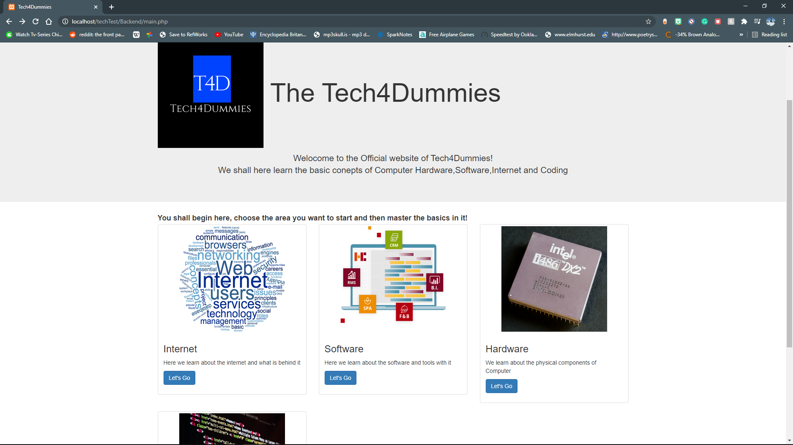

# Welcome to the Tech4Dummies 
> This group consists of Akhil Nair, Chris Grace and Yatharth Mathur. And what our page is about:

Tech4Dummies is a project passionately created by 3 University of British Columbia students to help educate the general public about our current technology. There was an understanding between the creators that the way for society to advance in the future would be by everyone understanding and utilizing the full potential of technology and embracing the opportunities it creates. We were fortunate enough to learn about computers at school or have the resources to learn on our own, Tech4Dummies is how we intend to let everyone else have the same opportunities as us to understand and use computers and the internet. 

At its current stage, Tech4Dummies is still in a work-in-progress stage with many more additions and improvements planned. The end product, as intended by us, is to provide Tech4Dummies users with lessons that creates a solid understanding of the fundamentals. We are optimistic about the future of the project and hope to help people grasp the future. 

> [This is the main page code](tech4dummies.github.io/techTest/Backend/main.php ), which we will run and show it to you in our demo 

> These are the pictures of the website: 

> This is the main page: 

>

> This is the course Pages, where we will be updating more content about Software,Hardware and coding:

>

>![] We also have Quizes to help you:

>
